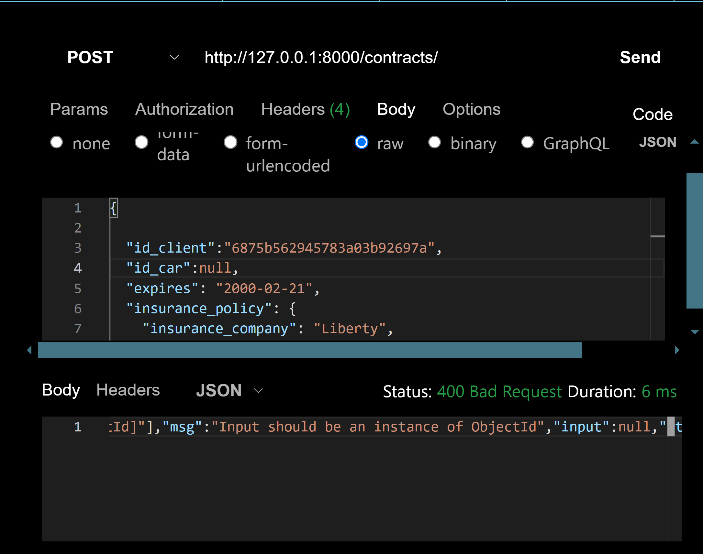

📌 Visão Geral
Este projeto utiliza Django REST Framework como backend API integrado com MongoDB.

✨ Funcionalidades Principais
API RESTful completa com Django REST Framework

🛠 Integração perfeita com MongoDB utilizando,apenas pymongo puro!

<h2>⛔Modelo baseado pydantic</h2>

Devido a natureza python e a estrutura dinâmica de um banco de dados não relacional,não há campos fixos. Para resolver isso foi utilizado modelo Pydantic, com integração MongoDB. Com isso, modelos ficam com a coêrencia de um banco relacional!

<ul> Exemplo de validação, onde falta do id_car impede a criação do contrato. </ul>

<h1>🛜End points </h1>
<ul>
<li>contracts/ -GET-POST-PUT DELETE</li>
<li>cars/ -GET-POST-PUT DELETE</li>
<li>client/ -GET-POST-PUT DELETE</li>
</ul>

Basicamente esta é uma API de locadora de carros, onde temos modelos(cars), clientes(client) e contratos de aluguel(contracts)

<h2>Exemplos de uso</h2>
 

<li>client/ or contracts?page=1<li>
para obter lista de items(funciona com todos os endpoints)

 

<li>contracts/<li>
para cadastrar um novo item(funciona com todos os endpoints)
<li>*OBS: verifique todos os campos necessarios no escopo do modelo</li>
 

<li>cars/<li>
para editar um item existente(funciona com todos os endpoints)
<li>*OBS: verifique todos os campos necessarios no escopo do modelo</li>
 

<li>cars?id=ao84eqc77d0bf67<li>
para apagar um item existente(funciona com todos os endpoints)

<h2>💻Instalação/implementação</h2>
<ul>
<li>Clone-o</li>
<li>Mude para a pasta: Django-Pymongo_hacks\Django_api</li>

<li>Crie um ambiente virtual: python -m venv myenv</li>
<li> Ative o ambiente virtual: myenv\Scripts\activate  # Windows </li>
<li> Instale as dependências: python -m pip install -r requirements.txt </li>
<li>entre na pasta: .../Django_api/api_core/
e inicie o servidor: python manage.py runserver </li>

OBS: precisa do MongoDB INSTALADO e rodando na máquina!!!

</ul>
